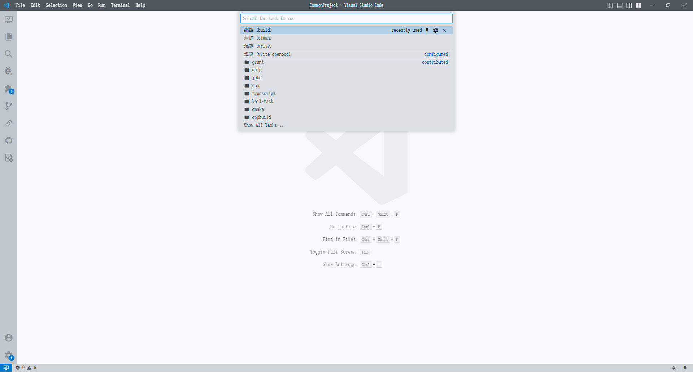

# 快捷任務（task.json）

---

通過 makefile 我們將海量的指令精簡至一條 make+ 指令，但是我比較懶，一條指令都不想敲。😎

---

1. 在工程目錄下的 .vscode 目錄中新建 tasks.json 文件並填入以下內容：

```
{
    "version": "2.0.0",
    "tasks": [
        {
            "label": "編譯（build）",
            "type": "shell",
            "command": "cd project/GCC | mingw32-make",
            "args": [

            ],
            "problemMatcher": [],
        },
        {
            "label": "清除（clean）",
            "type": "shell",
            "command": "cd project/GCC | mingw32-make clean",
            "args": [

            ],
            "problemMatcher": [],
        },
        {
            "label": "燒錄（write）",
            "type": "shell",
            "command": "cd project/GCC | mingw32-make write",
            "args": [

            ],
            "problemMatcher": [],
        },
        {
            "label": "燒錄（write.openocd）",
            "type": "shell",
            "command": "cd project/GCC | mingw32-make write.openocd",
            "args": [

            ],
            "problemMatcher": [],
        },
    ],
}
```

<br>


2. 找到菜單欄依次點擊 Terminal -> RunTask 然後選擇：

- 編譯（build）
- 清除（clean）
- 燒錄（write）
- 燒錄（write.openocd）


