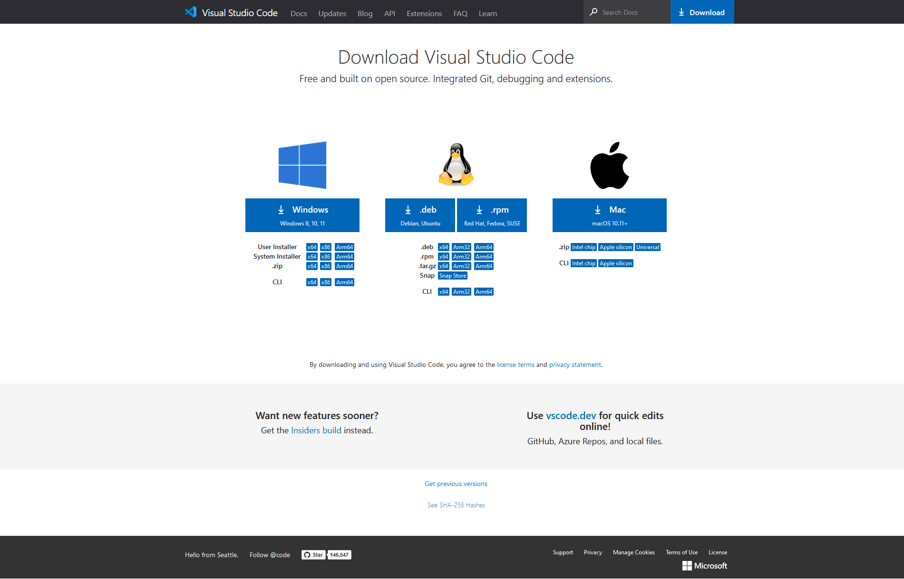
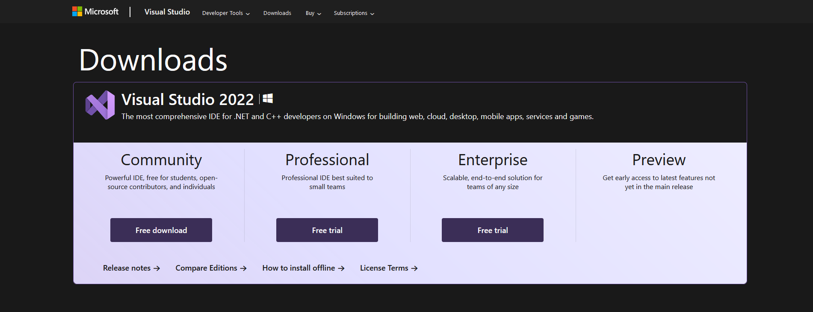
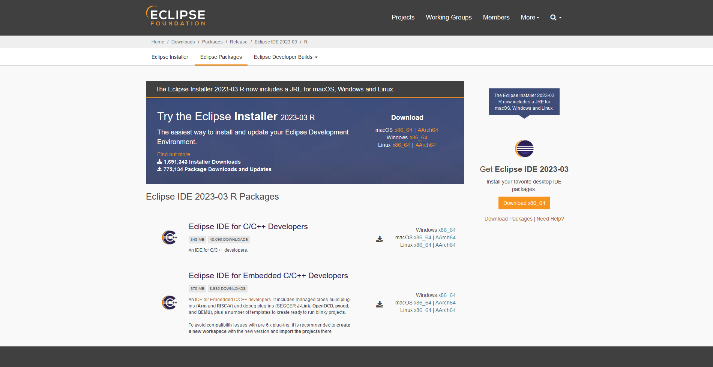

# 環境搭建

---

## 編輯器安裝

- **VSC**

<a href="https://code.visualstudio.com/Download">https://code.visualstudio.com/Download</a>
 

- **VS**

<a href="https://visualstudio.microsoft.com/downloads/">https://visualstudio.microsoft.com/downloads/</a>
 

- **Eclipse.Embedded**

<a href="https://www.eclipse.org/downloads/packages/">https://www.eclipse.org/downloads/packages/</a>
 

 

## 編輯器插件

- **[vscode :: cortex-debug](https://github.com/Marus/cortex-debug/wiki)**

- **[vscode :: eide](https://em-ide.com/zh-cn/)**

 

## 編譯器安裝

- **[Arm GNU Toolchain (12.2.Rel1 based on GCC 12.2)](https://developer.arm.com/downloads/-/arm-gnu-toolchain-downloads)**

- **[Arm GNU Toolchain for the Cortex-A (10.3-2021.07 based on GCC 10.3)](https://developer.arm.com/downloads/-/gnu-a)**

- **[Arm GNU Toolchain for the Cortex-R & Cortex-M (10.3-2021.10 based on GCC 10.3)](https://developer.arm.com/downloads/-/gnu-rm)**

- **[xPack GNU Arm Embedded GCC toolchain](https://xpack.github.io/dev-tools/arm-none-eabi-gcc/releases/)**

!> 記得將安裝目錄添加至系統環境變量

 

## 調試器安裝

- **[SEGGER JLink Installer](https://www.segger.com/downloads/jlink/#J-LinkSoftwareAndDocumentationPack)**

- **[OpenOCD prebuilt by xPackProject](https://xpack.github.io/dev-tools/openocd/releases/)**

- **[OpenOCD prebuilt by Sysprogs](https://gnutoolchains.com/arm-eabi/openocd/)**

- **[OpenOCD prebuilt by OpenOCD.org](https://github.com/openocd-org/openocd/releases)**

!> 記得將安裝目錄添加至系統環境變量

 

## 自動化工具

- **[make](https://gnutoolchains.com/arm-eabi/openocd/)**

- **[ninja](https://gnutoolchains.com/arm-eabi/openocd/)**

- **[cmake](https://gnutoolchains.com/arm-eabi/openocd/)**

?> 請參考這篇 make 安裝教程：[點擊跳轉]()

?> 理論上安裝完編輯器、編譯器和調試器之後就能夠使用了，安裝上述工具是爲了提高開發效率。

 
