# 遠程調試

---

遠程調試有以下幾種方式：

<font face="Iosevka Fixed Slab">

- OpenOCD

- JLink.GDBServer + VSC

- JLink.RmtServer + JLink/IAR/MDK

</font>

?> JLinkRemoteServer 是 Segger 提供的另一個遠程調試工具，不過好像只有 JLink/IAR/MDK 支持該方案。


## OpenOCD

略.

<br>


## JLinkGDBServer + VSC

1. 在服务主机上配置开启 JLink 调试服务器（该服务器会监听 2331 端口）

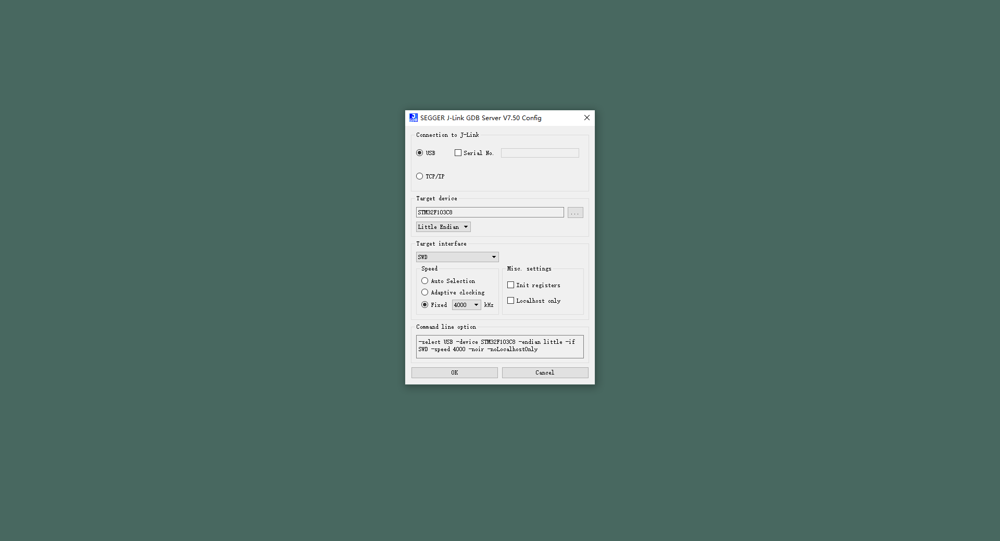

!> 不要勾选 Localhost Only 选项！

2. 等待连接

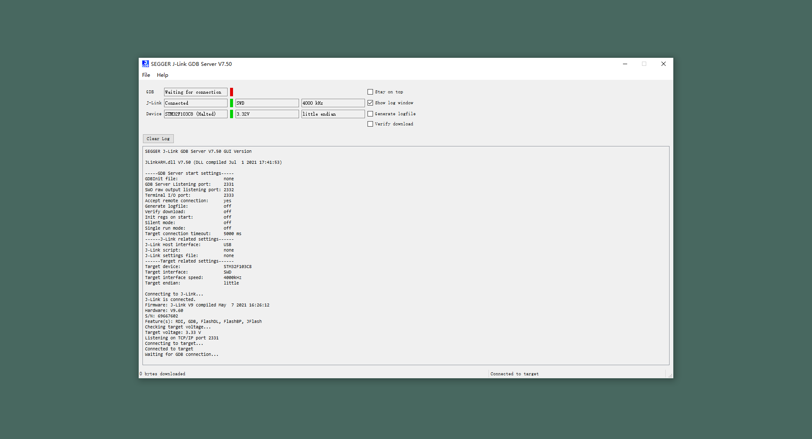
<center></center>

3. 在本地主机上配置 launch.json 文件并启动调试

```
{
    "name": "Debug@RemoteServer(GDBServer/JLinkGDBServer)",
    "type": "cortex-debug",
    "servertype": "external",
    "request": "attach",
    "cwd":"${workspaceRoot}",
    "executable": "./build/main.elf",

    "gdbTarget": "192.168.1.1:2331",
},
```

[cortex-debug-issues#244 : remote debugging](https://github.com/Marus/cortex-debug/issues/244)

[cortex-debug-wiki : external gdb server configuration](https://github.com/Marus/cortex-debug/wiki/External-gdb-server-configuration)

?> 点击启动调试后 cortex-debug 便会帮助我们通过本地 xGDB 客户端连接远程 GDB 服务器。

4.建立连接

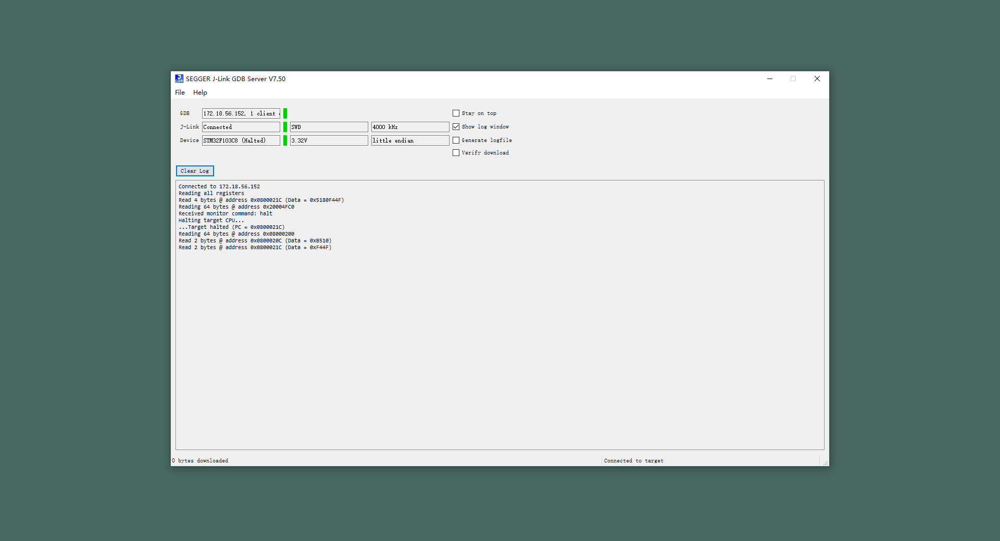

5. 远程调试

```
此处省略一张在 vscode 中调试的图片
```

6. 断开连接

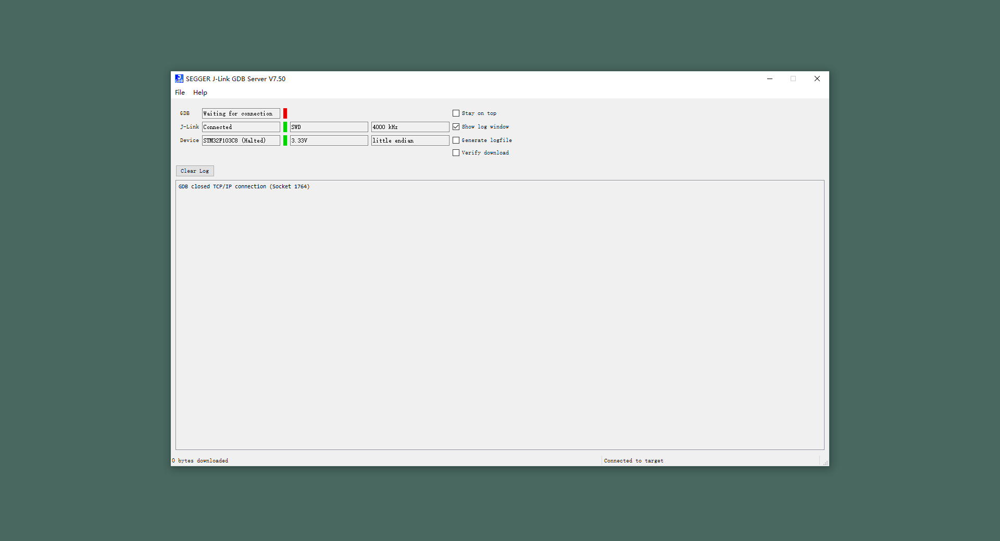

<br>


## JLinkRmtServer + JLK

### 通过 SEGGER 提供的隧道进行远程连接

1. 在服务主机上配置开启 JLink 远程服务器（隧道方式）

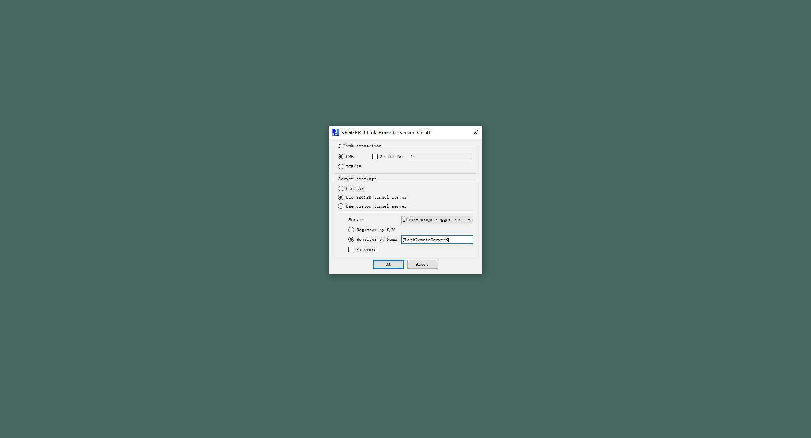

2. 等待连接

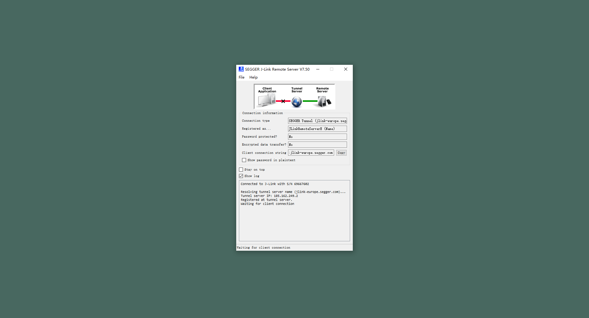

3. 在本地主机上配置连接 JLink 远程服务器（隧道方式）

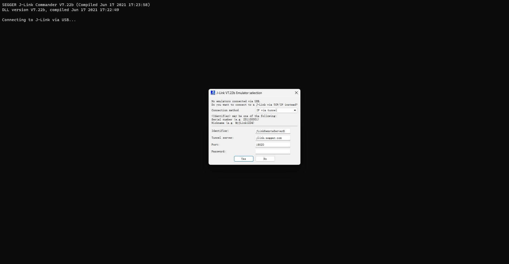

4. 建立连接

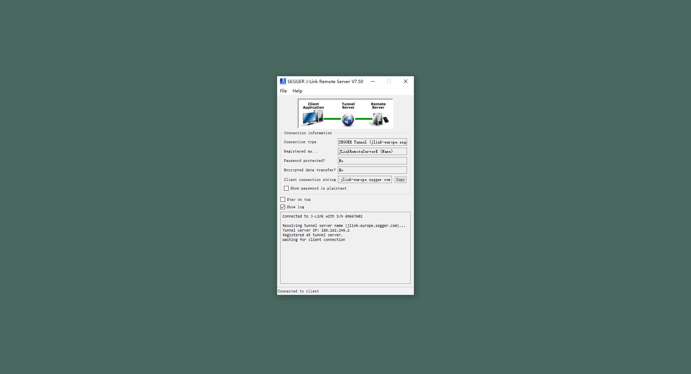

5. 远程调试

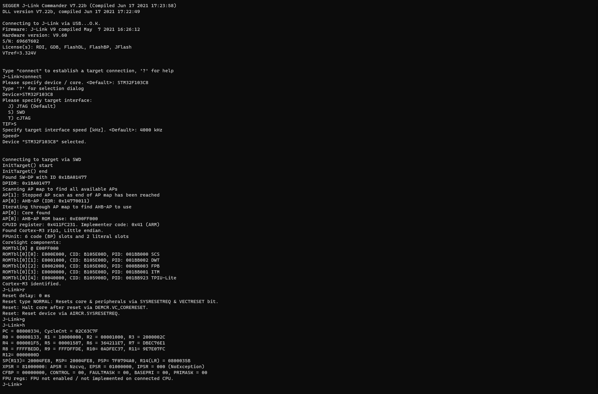

6. 断开连接

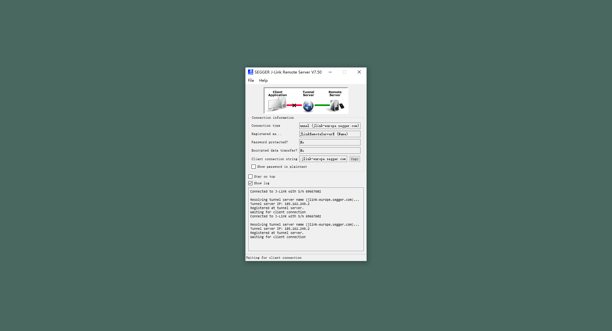

<br>

### 通过内网或者内网穿透工具进行远程连接

1. 在服务主机上配置开启 JLink 远程服务器

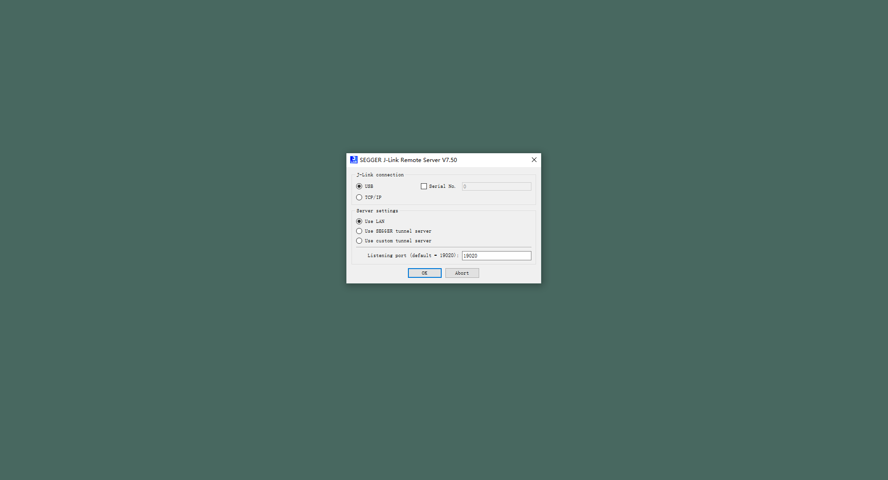

2. 等待连接

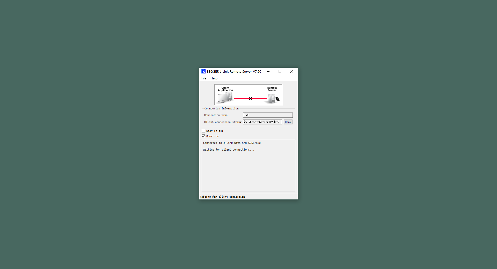

3. 在本地主机上配置连接 JLink 远程服务器

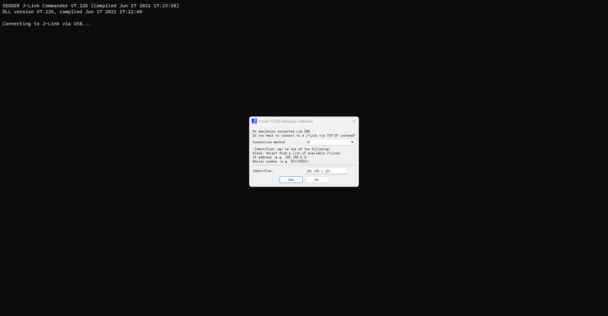

4. 建立连接

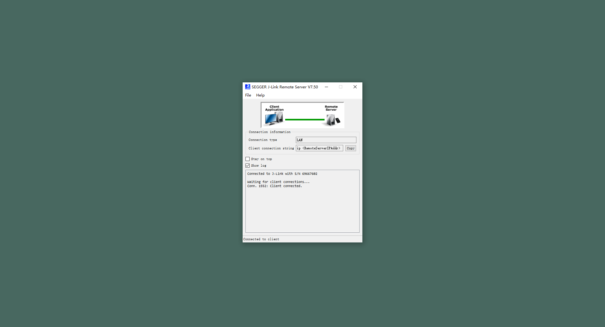

5. 远程调试


6. 断开连接

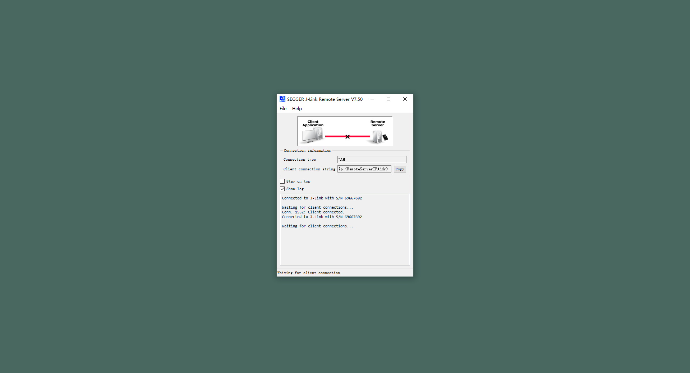

<br>


## JLinkRmtServer + MDK

### 在 Keil MDK 中通过内网或者内网穿透工具进行远程连接

1. 在服务主机上配置开启 JLink 远程服务器


2. 等待连接


3. 在本地主机上配置连接 JLink 远程服务器

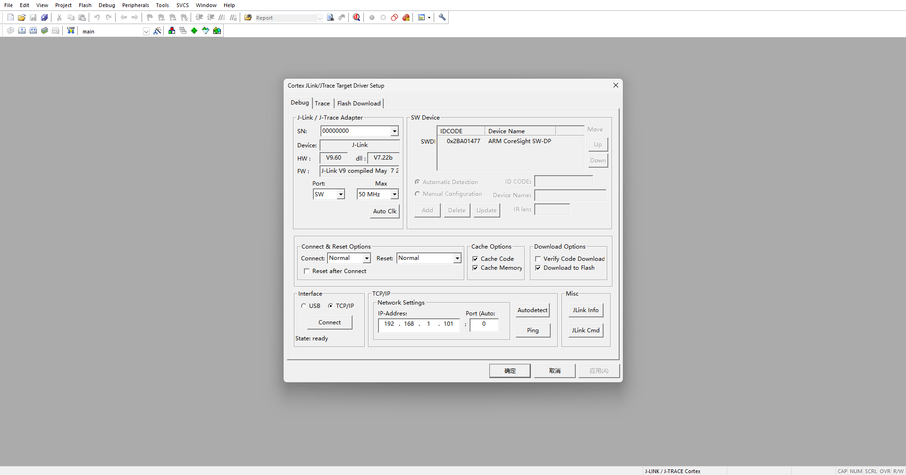

4. 建立连接


5. 远程调试


6. 断开连接


<br>
