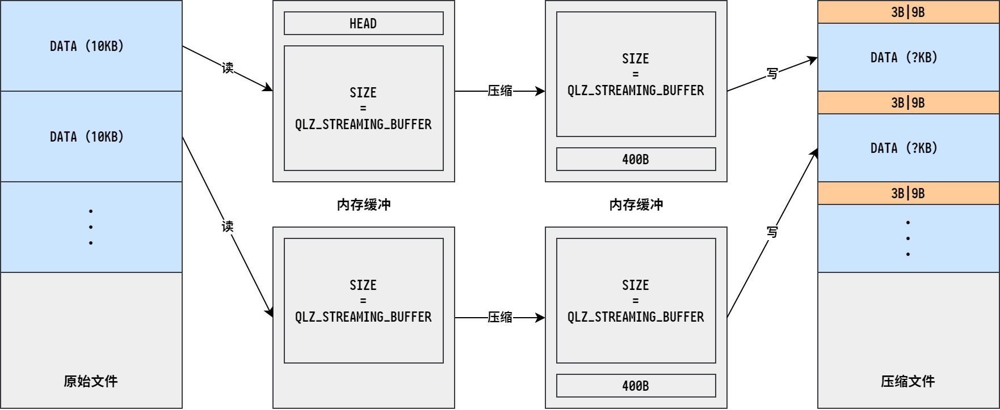
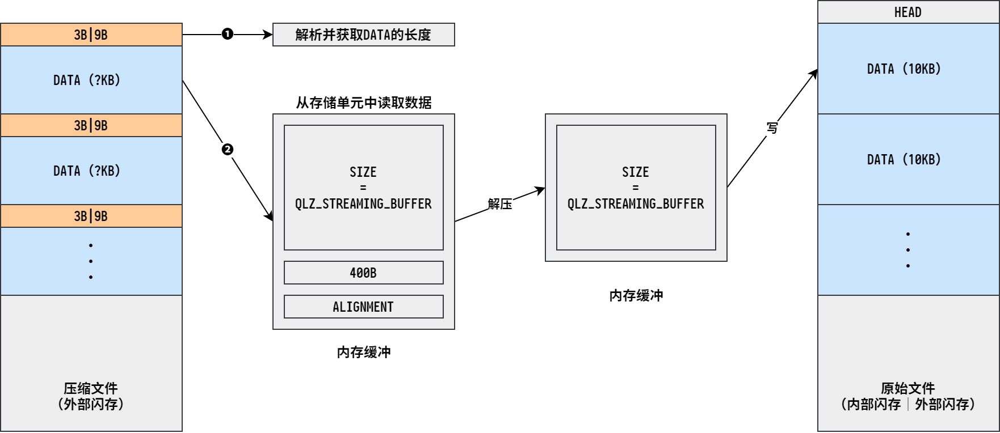

# 压缩解压工具 <!-- {comment docsify-ignore-all} -->

---

软件作者：赵长收

本文编辑：刘吉同

---

## 软件信息

软件使用 [QuickLZ](http://www.quicklz.com/index.php) 压缩算法。

## 使用说明

支持的选项列表：

```
"-c"    "-C"    "--compress"    压缩
"-d"    "-D"    "--decompress"  解压
"-h"    "-H"    "--help"        帮助
"-f"    "-F"    "--force"       覆盖重名文件
"-p"    "-P"                    显示压缩进度
"-o"    "-O"    "--output"      指定输出文件 + 文件名称
"-k"    "-K"                    指定分片大小 + 分片大小
"-s"    "-S"                    压缩之前加头 + 硬件版本 + 软件版本
"-t"    "-T"                    压缩之后加头 + 硬件版本 + 软件版本
"-i"    "-I"                    只加头不压缩
"-e"    "-E"                    额外输出添加头的文件
"-m"    "-M"                    检查原始文件是否已经包含头部信息（如果已经包含则打印告警信息）
```

举个栗子：

```
# example.bat

.\bin\QuickLZ.exe -c -f -m -k 4000 -t 1.00,1.00 -o .\bin\MW2000_HCM32L196.QuickLZ.00.bin .\bin\MW2000_HCM32L196.bin

# 压缩・覆盖・检查・压缩数据块长度为4000字节・压缩之后加头・输出至.\bin\MW2000_HCM32L196.QuickLZ.00.bin・原始文件为.\bin\MW2000_HCM32L196.bin

.\bin\QuickLZ.exe -c -f -m -k 4000 -s 1.00,1.00 -t 1.00,1.00 -o .\bin\MW2000_HCM32L196.QuickLZ.01.bin .\bin\MW2000_HCM32L196.bin

# 压缩・覆盖・检查・压缩数据块长度为4000字节・压缩之前加头・压缩之后加头・输出至.\bin\MW2000_HCM32L196.QuickLZ.01.bin・原始文件为.\bin\MW2000_HCM32L196.bin
```

## 开发说明

建议先阅读一下 QuickLZ 官方[说明手册](http://www.quicklz.com/manual.html)和下载页的[相关说明](http://www.quicklz.com/download.html)。

在 quicklz.h 文件中，有以下三个宏定义：

- **设置压缩级别** `QLZ_COMPRESSION_LEVEL`

  可设级别（1｜2｜3）

  级别 1 具有更快的压缩速度，而级别 3 则具有更快的解压速度。根据需要选择。

- **设置压缩模式** `QLZ_STREAMING_BUFFER`

  设置为 0 表示使用普通压缩模式，设置非 0 表示使用串流压缩模式，数值为串流缓冲区的大小。

  该压缩算法的原理是查找重复的字符串，因此压缩比与数据实体的大小成正比，数据实体越大，压缩比越高。当数据实体小于 10KB ~ 50KB 时，压缩比会显著降低，因此官方建议将串流缓冲区的大小设置为 100KB 以上。

  使用串流压缩模式的情况下，应当按照压缩时的顺序进行解压。

- **内存安全模式** `QLZ_MEMORY_SAFE`

  略.

!> 注意！压缩侧与解压侧的压缩级别和压缩模式应当一致！

## 技术细节

### 压缩流程



首先从原始文件中读取若干字节的数据，然后压缩，将压缩好的数据写入到压缩文件中，如此往复，直至全部压缩完毕。

如果需要添加头部信息，应在读取第一包数据前先往缓冲区中写入该信息。

### 解压流程



首先从外部闪存中读取 9 字节长的区块信息，解析得到当前区块的长度，然后将该区块剩余的数据读至内存中并解压，如果压缩之前没有添加头部信息，则可以将当前解压的数据写入内部闪存，即一边解压一边写入；如果添加了头部信息，那么需要等全部解压完校验无误后再写入内部闪存，此时可以将解压的数据区块临时存放至内存中，内存空间不够的话也可以暂存到外部闪存中。

### 算法细究

普通压缩模式和串流压缩模式的区别在于：

普通压缩模式：数据实体之间没有关联。每次压缩之前都会重置哈希表。

串流压缩模式：数据实体之间存在关联。只有当压缩的数据超过串流缓冲区的大小时才会重置哈希表。

**普通压缩模式：**
```
reset_table_compress(state);
qlz_compress_core(source, destination, size, state);
state->stream_counter = 0;
```

**串流压缩模式：**
```
# state->stream_counter + size - 1 < QLZ_STREAMING_BUFFER

qlz_compress_core(source, destination, size, state);
state->stream_counter += size;
```

```
# state->stream_counter + size - 1 >= QLZ_STREAMING_BUFFER

reset_table_compress(state);
qlz_compress_core(source, destination, size, state);
reset_table_compress(state);
state->stream_counter = 0;
```

### 用户交互

略.（命令行解析）
