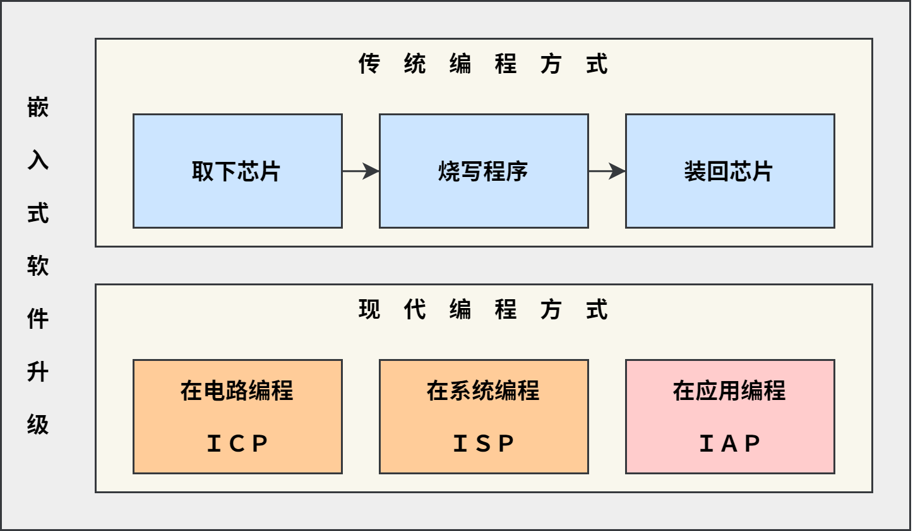
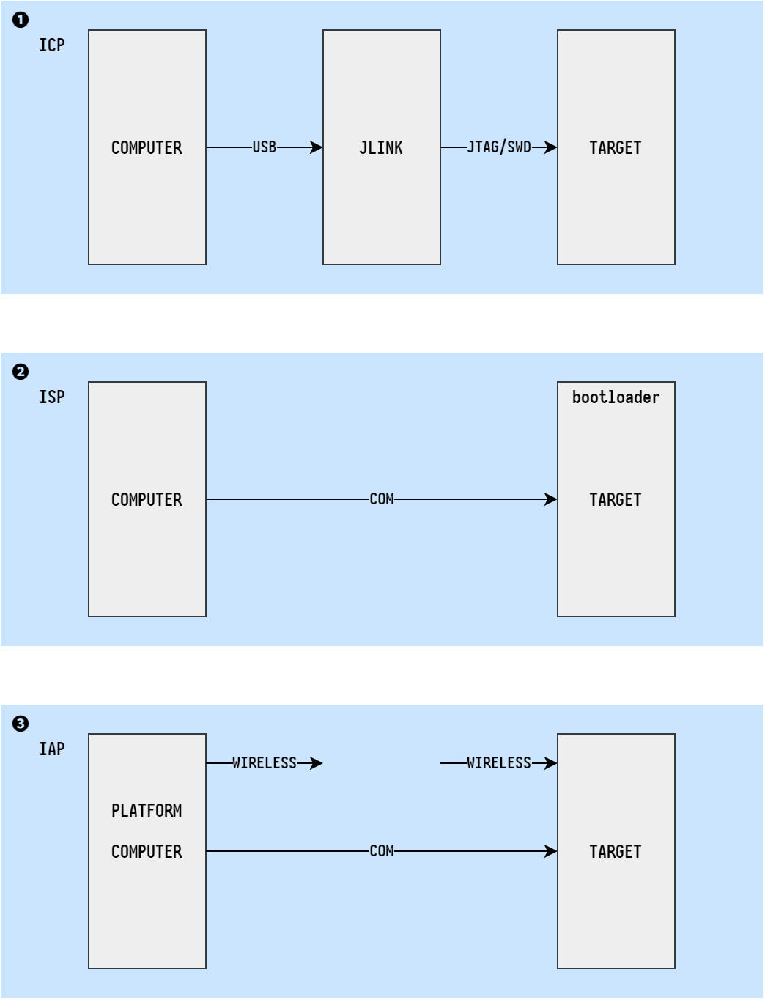
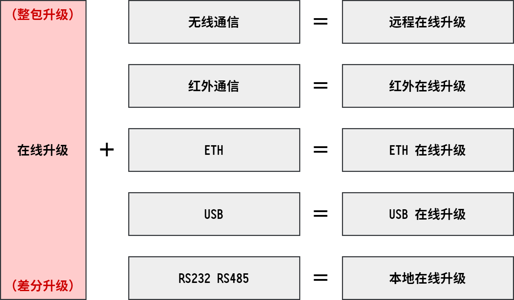
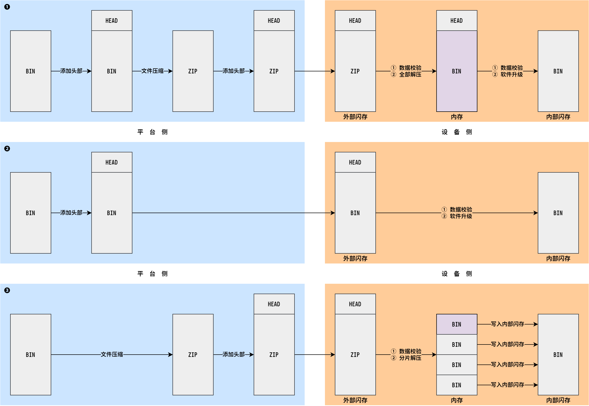
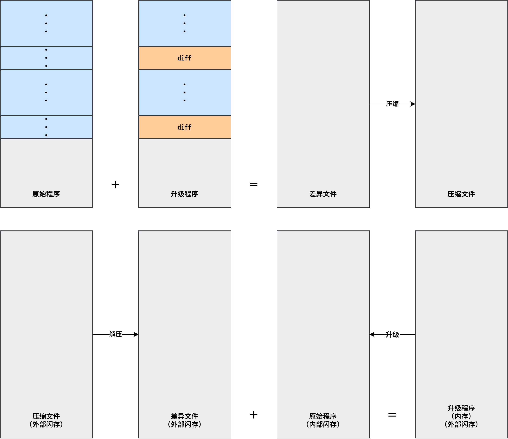
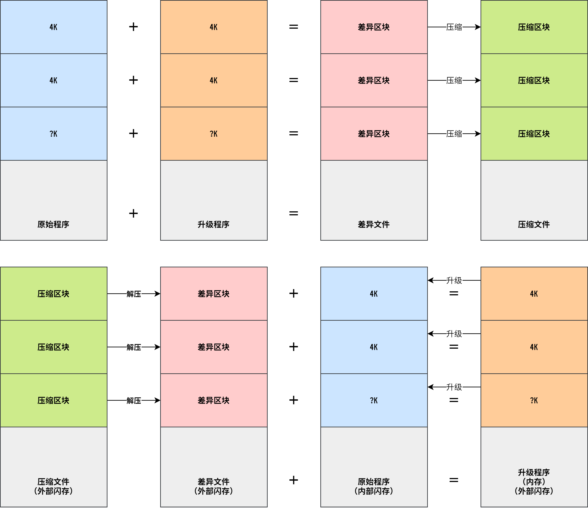
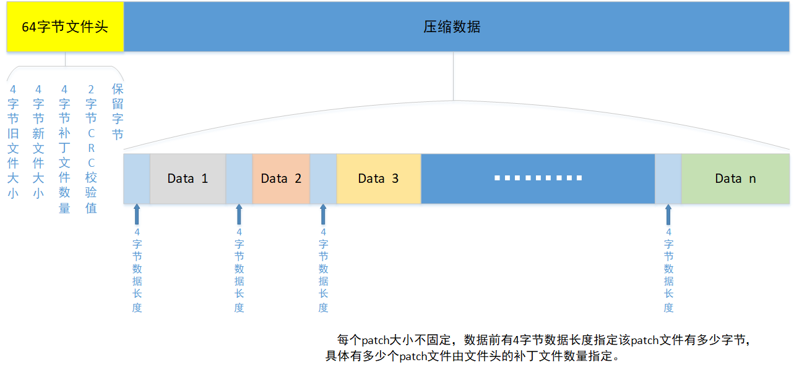
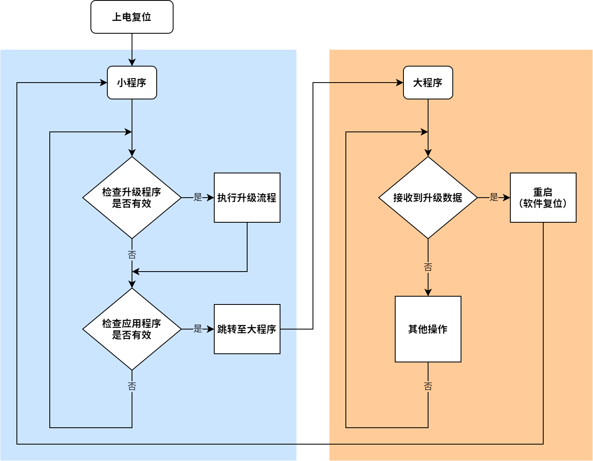
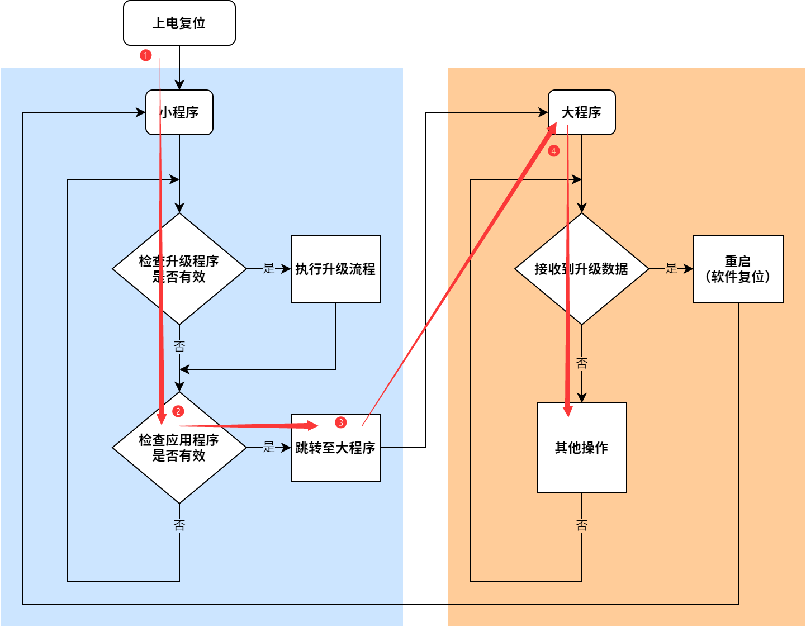
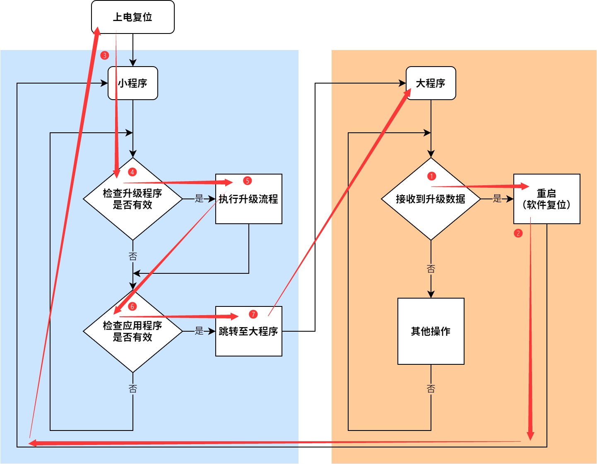

# 在线升级功能 <!-- {comment docsify-ignore-all} -->

---

软件作者：刘吉同

本文编辑：刘吉同

---

在深入探讨在线升级之前我们先来回顾一下常用的升级方式有哪些。

## 升级方式

### ㊀ 传统编程方式

传统编程方式是先将程序烧录至主控芯片中再焊接到电路板上。

**开发阶段**

- ➀ 从电路板上取下芯片
- ➁ 使用烧录器烧写程序
- ➂ 将芯片装回至电路板

**量产阶段**

- ➀ 从 tray 盘取出芯片
- ➁ 使用烧录器烧写程序
- ➂ 将芯片放回 tray 盘

**成品阶段**

- ➀ 从电路板上拆下芯片
- ➁ 使用烧录器烧写程序
- ➂ 将芯片焊回至电路板

### ㊁ 现代编程方式

现代编程方式可以直接进行板上烧录，不用再取下芯片放到专用的烧录器上烧写程序，极大地提高了开发、生产以及维护效率。

目前常用的编程方式有：

- 在电路编程 ICP (In Circuit Programming)
- 在系统编程 ISP (In System Programming)
- 在应用编程 ISP (In Application Programming)

**➀ ICP**

ICP 借助外部器件（例如仿真器）使用调试接口（JTAG/SWD）对芯片进行整片烧录。MCU 只需处于上电状态即可，不必预先烧录任何程序，烧录范围涵盖整颗芯片。

ICP 使用有线通信。

**➁ ISP**

ISP 借助外部软件（上位机软件）使用通信接口（UART/SPI）对芯片进行部分烧录。MCU 需要处于能够运行程序的状态（最小系统（上电＋时钟电路））且必须预先烧录 boot 程序并在上电后运行该引导程序（例如 STM32 的 BOOT 模式〔boot from system memory〕）。烧录范围有限，起码不包括 boot 程序所在的存储单元。

ISP 使用有线通信。（如果芯片厂商内部集成的 boot 程序支持无线通信当然也可以使用无线连接，只不过没有厂商会这么干罢了）

**➂ IAP**

IAP 借助外部软件（上位机软件）将升级程序从平台侧传输至设备侧，设备侧收到升级数据后从 APP 执行空间切换至 IAP 执行空间，然后使用新的升级数据替换 APP 地址空间中原有的程序代码。

IAP 可以使用有线通信，也可以使用无线通信。

**选择哪种升级方式？**

首先要明确的一点是，三者的选择不是非此即彼的，在一个项目周期中，这三种升级方式我们可能都会用到。

大规模生产时，通常会用到 IAP 升级，除非程序非常成熟无需升级，或者商业模式不允许升级。

开发阶段：通常使用 ICP 升级，方便快捷。如果没有仿真器也可以使用 ISP 升级，节省成本。

量产阶段：通常使用 ICP 升级，方便快捷。如果没有仿真器也可以使用 ISP 升级，节省成本。

成品阶段：通常使用 IAP 升级，方便快捷。如果设备异常则只能亲自到仓库或现场拆开设备使用 ICP 或 ISP 升级调试。

如果产品需要支持 IAP 升级，则需要编写引导程序，不过在开发之前要先确定好升级方案，考虑好是使用是整包升级还是差分升级，以及是否压缩等。

## 升级方案

!> 注意！远程升级只是在线升级的一种实现方式，不要将二者混为一谈！

## 整包升级

### 整包升级方案

**➀ 添头＋压缩＋添头**

设备收到数据后，先根据外层头部信息对压缩包进行校验，校验通过后将压缩包完全解压（解压至内存或外部闪存），然后根据内层头部信息对镜像包进行校验，校验通过后便可执行升级。

**➁ 添头**

设备收到数据后，先根据外层头部信息对镜像包进行校验，校验通过后便可执行升级。

**➂ 压缩＋添头**

设备收到数据后，先根据外层头部信息对压缩包进行校验，校验通过后可以一边解压一边升级。（该方式节省内存或外部存储空间）

### 整包升级方案选择

第➀个方案由于需要全部解压，比较占用内存空间或外部存储空间，不选择。第➁个与第➂个方案的均可行，不过为了最小化升级包的体积，本产品选择第➂个方案。

### 整包升级流程

## 差分升级

差分升级使用开源的 bsdiff 工具实现，差分与解差分的空间复杂度和时间复杂度在作者的[个人主页](https://www.daemonology.net/bsdiff/)上有介绍。

在不考虑内存占用时，可以按照以下流程对文件整体进行差分并解差分。

但是在嵌入式平台中，内存空间往往受限，使得上述流程并不可行。因此需要将原始程序分成若干份分别进行差异分析。

## 引导程序

### 大小程序

引导程序，也就是我们常说的小程序，负责程序的升级与跳转，其具体执行流程见下图。

◎ 大小程序
 

### 开机流程

◎ 开机流程
 

### 升级流程

◎ 升级流程
 
