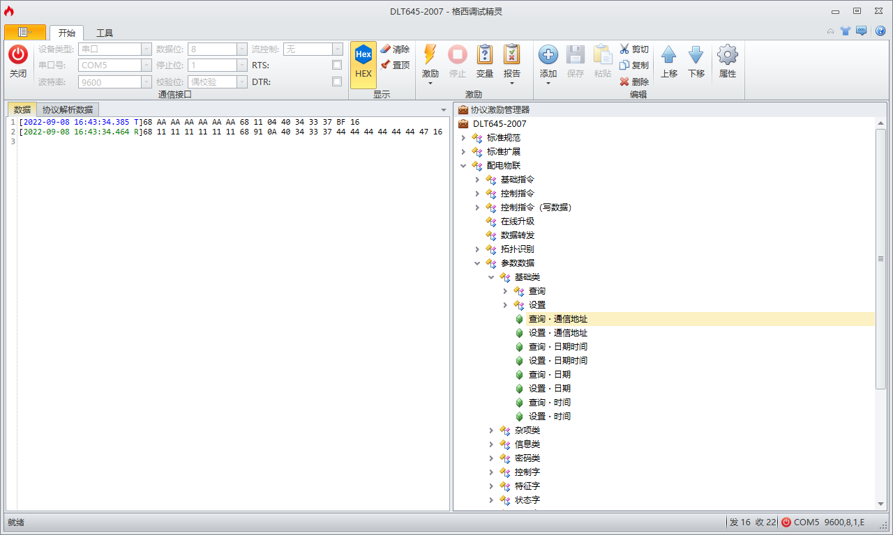
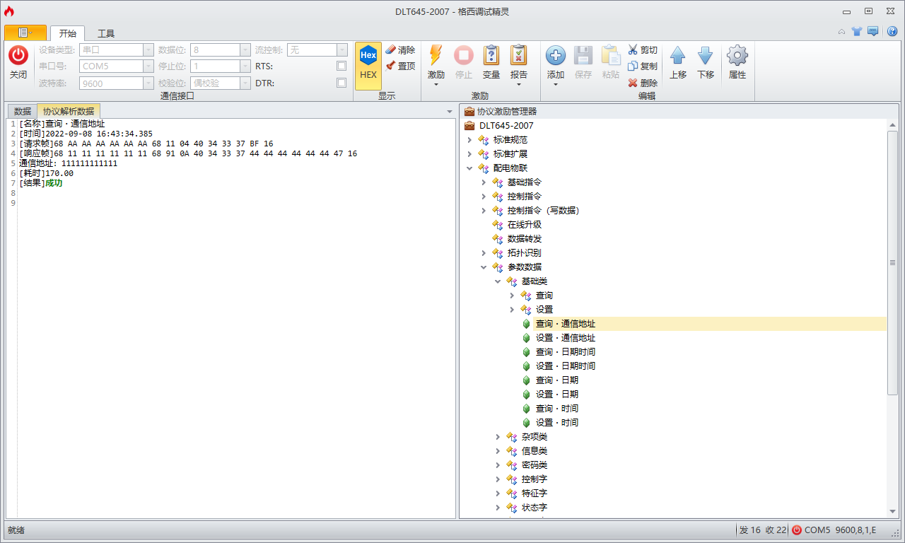
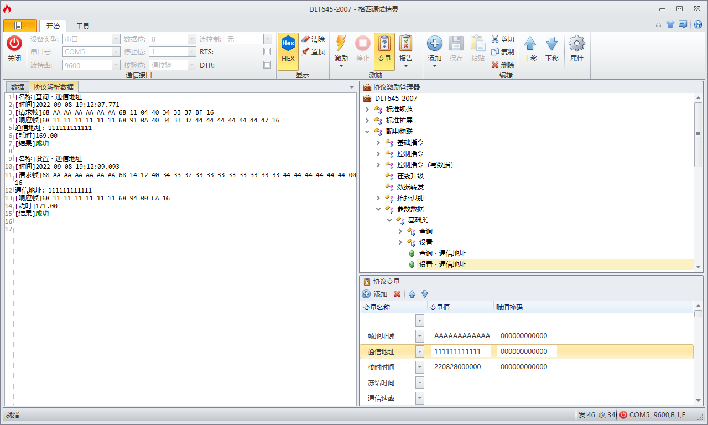

# 格西调试精灵 <!-- {comment docsify-ignore-all} -->

---

软件作者：第三方（[格西科技](http://www.geshe.com/zh-cn/)）

本文编辑：刘吉同

---

## 下载链接

- [格西调试精灵](http://www.geshe.com/zh-cn/products/ggenius)
- <a href="/共享空间/格西调试精灵/公共资源/DLT645-2007.bcp" download>协议激励文件（DLT645-2007）</a>

?> 我本人以及其他开发者会不定期地更新协议激励文件，所以建议大家从 svn 库中 checkout 至本地，方便随时更新。当然你也可以通过上述下载链接来手动更新，只不过会稍微麻烦些。


<center>
◎ <a href="http://svn.sulfurandcu.com/共享空间/格西调试精灵" target="_blank">http://svn.sulfurandcu.com/共享空间/格西调试精灵</a>
</center>

## 授权说明

本软件需要购买授权，授权方式分两种：

- 完整版
  - 在线授权：39元/每年，需要联网使用，不对电脑绑定，同一时间仅限一台电脑使用。
  - 离线授权：99元/永久，绑定一台电脑，等于电脑寿命，重装系统不影响，不能解绑。
- 免费版
  - 基本功能
  - 直接激励
  - 协议激励（激励文件无法保存）

当前我们仅有一台电脑具有离线授权。但是！这并不妨碍我们薅羊毛：具有授权的开发者来编辑激励文件，其他人只要奉行拿来主义就好啦！

- 开发者（使用具有授权的电脑编写激励文件，并将激励文件上传至代码仓库）
  - 用户一（从代码仓库中下载激励文件并使用）
  - 用户二（从代码仓库中下载激励文件并使用）
  - 用户ㄣ（从代码仓库中下载激励文件并使用）

## 使用说明

### 准备工作

- 第一步：下载格西调试精灵并安装
- 第二步：下载所需的协议激励文件（见[**下载链接**](#下载链接)一章）
- 第三步：打开格西调试精灵，点击打开协议激励项目，选择刚刚下载的协议激励文件，就可以使用了。


### 到底咋用？

### 案例一：查询通信地址（报文界面）



### 案例二：查询通信地址（解析界面）



### 案例三：设置通信地址



设置参数时请注意，需要在「协议变量」一栏中正确地填写参数字段。

## 用户手册

```pdf
/sulfurandcu.doc/共享空间/格西调试精灵/公共资源/格西调试精灵手册.pdf
```
